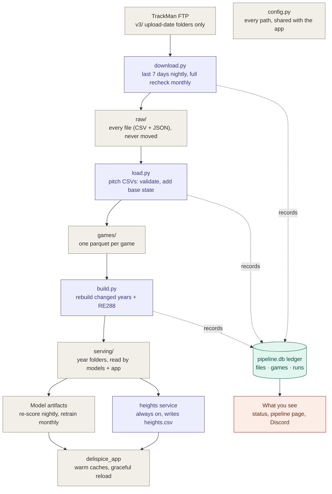
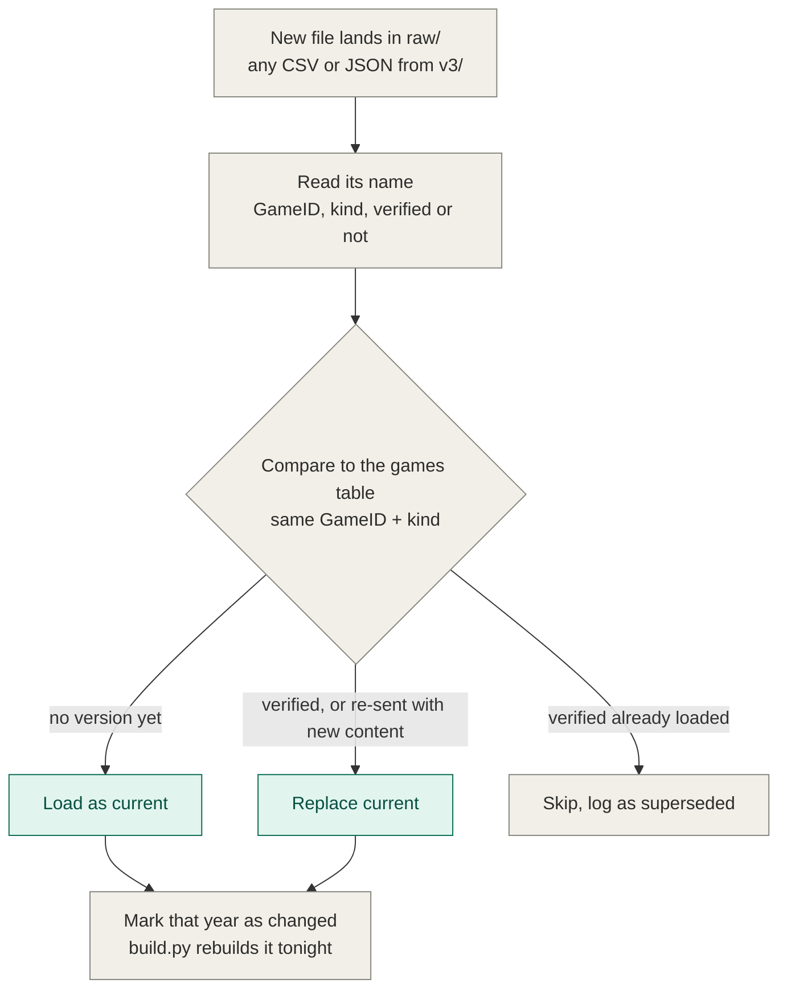

# pipeline_v2: the data_pipeline rewrite

Status: **phase 0 in progress** (plan written 2026-10-03). Nothing on the server has changed yet.

The new pipeline lives in its own folder, **`pipeline_v2/`** (code, this plan, `docs/`), built on the **`pipeline-v2`** git branch. The old `data_pipeline/` keeps running untouched until cutover and is deleted in the cleanup.

Guiding rule: **simple and efficient beats complex, and every file and run must be traceable.**

---

## 1. Why: what's wrong today

### How the current pipeline works

The server pipeline (`~/delispice/data_pipeline` on `mausington`) is two cron jobs linked only by the clock. A file's folder is its only record of status: each stage marks a file done by moving it into an archive subfolder.

| When | Job | What it does |
|---|---|---|
| 02:00 daily | `bash_scripts/factory.sh` | `lftp` downloads TrackMan's `/v3/<yesterday>/CSV/` into `data/unprocessed/`, deletes `*unverified*` / `*playerpositioning*` CSVs, moves the rest to `data/processed/`. JSON is left behind. |
| 03:00 daily | `run_pipeline.py` | 1. `pipeline_scaffold.py`: `data/*.csv` → read as text → convert types → add missing columns (201) → `fix_dictionary` → pandera validation → `clean/*.parquet`; source moved to `data/cleaned/`; failures copied to `quarantine/`. 2. `baserunner_state.py`: `clean/*.parquet` → adds `on_1b/on_2b/on_3b`, `base_state`, `re288_state` → `wbaserunners/{D1\|Others}/YYYY/MM/DD/`; source moved to `clean/processed/`. 3. `height_scraper.py`: up to 250 players/night from Baseball Reference → `heights.csv`. |
| 04:00 on the 1st | `run_pipeline.py --monthly` | Stages 1–3 again, then `compact.py` (merges `wbaserunners/` in place: past years → one file, finished months → one file) and `re_matrix.py` (→ `re_matrices/re288_matrix.{parquet,csv}`) |

Readers: `delispice_app` (`data.py`, `leaderboard.py`) and `backend/models` read `wbaserunners/`, `heights.csv` and the RE288 matrix.

### What's wrong

- **Broken since 2026-07-05.** Until then the pipeline lived in `~/delispice/backend/`, and cleaning read `backend/data/processed`. After the move to `data_pipeline/`, cleaning reads `data/*.csv` (top level only), but `factory.sh` still drops CSVs into `data/processed/`. 1,166 games (Jul 4 – Sep 22) are stranded, and the app's newest game is Jul 3. Every night logs "No CSV files found" and reports "failed stages: none". Only the height scraper still does real work.
- **Re-sent games would be double-counted.** TrackMan re-sends corrected games under the same name. `compact.py` appends daily files into existing month/year files without removing the old version. 16 of the stranded files share a name with games already processed, and 8 have different contents (e.g. `20260604-GoodallPark-2` grew from 254 to 303 lines).
- **Two height scrapers can overlap on the 1st.** The daily run ends ~3:51 and the monthly run starts at 4:00. Overlapping would double the request rate to Baseball Reference, near its ban threshold, with both appending to `heights.csv`.
- **Failures are invisible.** Stages are linked only by the clock, and finding zero files counts as success.
- **`factory.sh`:** not in git; every log line doubled (tee + cron redirect to the same file); off-season it tries to download the `practice` and `v3` folders and dies before logging "Run complete".
- **Bat-tracking JSON is downloaded and never used.** 1,959 files in `data/unprocessed/`, including nested `2026/MM/DD/CSV/` folders from an earlier download method.
- **Folder names mislead:** `data/processed` means "downloaded, waiting"; `data/cleaned` (the code's archive) is empty while the real 30,851-file history is in `data/cleaned_csvs`; `clean/` and `data/cleaned` are easy to mix up.
- **Height scraper:** only handles 403/429, so a Baseball Reference 500 crashed it on 2026-10-02 (progress was saved). `--backfill` never ran (`logs/backfill.out` shows a broken `~` path); all ~18.5k rows came from nightly runs.
- **Clutter:** ~150 per-worker logs in `logs/`; the `--monthly` docstring doesn't mention that the scraper runs again.
- **The app never picks up new data on its own** (see §8).

---

## 2. Facts checked against the data (2026-10-03)

| Question | Finding |
|---|---|
| Does `GameID` equal the filename key `YYYYMMDD-<stadium>-N`? | Yes, in 30,851 / 30,851 processed games. One `GameID` per file. |
| Does an unverified file keep the same key as its verified version? | Yes, 170 / 170 JSON pairs (`GameReference`). PitchUIDs were identical in every pair too. |
| Can `GameUID` be the key? | **No.** It changed between unverified and verified in 1 of 170 pairs. |
| How late do verified files arrive? | Median ~13 h after the unverified file, max ~19 days. |
| Can bat-tracking JSON join to the pitch CSV? | Yes. JSON `GameReference` = CSV `GameID`, JSON `SessionId` = CSV `GameUID`, and plays match on `PitchUID` and `PlayID` (272 / 272). |
| What's in the JSON? | Header plus `Plays[]`. BatSpeed/HAA/VAA are copies of CSV columns (58 / 58 identical). The new data is the swing path `BatPath.PreImpactSwing {Time, Barrel, UpperGrip}` (40–51 samples per swing) and raw camera tracks (`BatUnsmoothedXYZ`). Summer files are nearly empty (353 files, 0.08 MB average). Spring files (1,606, Feb–Jun 2026) average **9.4 MB**, with raw tracks on most plays and swing paths on ~15–30% of plays. All are Version 1.0.1. About 8% of 2026 games have a full-size JSON. |
| Name suffixes seen | `_unverified`, `_unverified_playerpositioning_FHC`, `_battracking`, `_unverified_battracking`. Stadium names can contain spaces and dots (`David F. Couch`). |
| Positioning files | Only 5 since June, all unverified, all Charles Schwab Field. We've never kept one, so the schema is unknown. |
| Can a pitch appear in two games? | Yes, once: `20260221-` and `20260222-RiddlePaceField-1` share the same 178 `PitchUID`s (one game delivered under two dates; their `GameUID`s differ too). |
| Missing dates | 1,827 pitch rows have a null `Date`. |
| Quarantine history | 0 files quarantined in all 13 logged runs (the fix dictionary was built from a full scan). |
| Server model setup | Only `cq_D1` artifacts exist (Jul 11). `lightgbm` isn't installed, so eye can't train there. The Mac has cq/eye/eyescore/rvstate/xrv for D1 + P4. |
| FTP | TrackMan's FTP uses a **self-signed certificate** (why `factory.sh` disables verification). The password was never committed to git. The root has two folders, `v3/` (game files, by upload date) and `practice/` (contents not explored yet). |
| Column-count variants | All 32,017 server CSVs are 167 or 170 columns, with no `SpinAxis3d*` block at all. Only 191 Mac CSVs (Jun 13 – Aug 2 2026) have the block: 199 columns, including `SpinAxis3dConfidence` (always empty so far), which today's pipeline drops. **Added to the v2 schemas** as a nullable string at TrackMan's position (after `SpinAxis3dVectorZ`), so the canonical schema is now 202 columns. TrackMan orders the `SpinAxis3dSeamOrientationBall…Amb1–4` block differently from the schema; output is reordered to the schema, so this is cosmetic. |
| Game counts per year | 3,047 (2022), 3,939 (2023), 5,317 (2024), 9,282 (2025), 10,432 (2026 so far) |
| Disk | 457 GB total, 302 GB free; the current data takes ~33 GB. |

### Storage estimates

Measured per game: pitch CSV **0.32 MB**; spring bat-tracking JSON **9.4 MB** (~8% of games today); `games/` parquet **0.20 MB**; `serving/` **0.09 MB**. Gzip compresses CSVs 3.4× and JSON 2.7×.

**50,000 games, every verified file with an unverified counterpart, today's JSON coverage (~4,000 games with JSON):**

| | Keep every unverified | Delete unverified once verified arrives |
|---|---|---|
| Pitch CSVs | 32 GB | 16 GB |
| Bat-tracking JSON | 75 GB | 38 GB |
| `games/` | 10 GB | 10 GB |
| `serving/` | 5 GB | 5 GB |
| **Total** | **~122 GB** | **~69 GB** |

- `games/` and `serving/` hold only the current version of each game, so the difference is entirely in `raw/`.
- Unverified CSVs cost only ~16 GB. **JSON is the variable that matters:** if bat tracking reaches every game, verified JSON alone is ~470 GB (~940 GB keeping unverified).
- Compression saves more than deleting: ~52 GB keeping everything compressed, ~34 GB deleting + compressing, ~195 GB even with JSON for every game.
- 50,000 games is ~2028 at ~11k games/year, not 5 years out.
- **Keeping everything:** ~45 GB for today's ~32k games (JSON only exists for 2026), then ~27 GB/year at the 2026 pace. That's roughly **10 years** of disk at today's JSON coverage, but **~1.5 years** if every game gets bat-tracking JSON. `status` tracks this (§9).

---

## 3. Design principles

1. **Raw files are immutable.** Each lands once in `raw/` and never moves.
2. **One ledger for status.** `pipeline.db` (SQLite) records every file, every game's current version, and every run. A file's location never encodes its status.
3. **One file per game** in `games/`. Replacing a game means overwriting that one file, so duplicates can't happen.
4. **`serving/` is always derived.** It's rebuilt from `games/` and can be thrown away at any time. **The app reads only `serving/`**, never `games/`.
5. **One `config.py`** for every path, imported by both the pipeline and the app.
6. **One schedule, one lock.** Nothing can overlap.
7. **Only convert what we use.** Positioning CSVs and bat-tracking JSON are kept and tracked in the ledger, but not converted until there's a use for them.

---

## 4. Architecture


<details>
<summary>Text version (Mermaid, for future sessions and plain-text readers)</summary>



</details>

Purple = script, gray = folder or file, teal = the ledger, coral = what you see. Dashed lines = each step records what it did in the ledger. `config.py` holds every path and is imported by both the pipeline and the app.

### Folder layout

```
pipeline_v2/
  config.py                    every path + setting, imported by the pipeline and the app
  plan.md, docs/               this plan and its diagrams (tracked)
  .env                         FTP login + Discord webhook (never committed)
  pipeline.db                  the ledger (SQLite)
  raw/YYYY/MM/DD/<original>    exact FTP copy: pitch csv, positioning csv, json
  games/YYYY/<GameID>.parquet  one per game (pitch data + base state)
  serving/pitches/{D1,Others}/YYYY/<level>_YYYY.parquet   e.g. serving/pitches/D1/2026/d1_2026.parquet
  serving/re288_matrix.parquet
  heights.csv                  moves here from data_pipeline/ at cutover
  logs/runs/YYYY-MM-DD.log     one log per run, kept (~1 MB/year)
  logs/workers/YYYY-MM-DD/     worker logs, auto-deleted after 1 year
```

**Why the year is a folder:** every reader in the app and models finds files as `<base>/<D1|Others>/<year>/**/*.parquet`, and checks that `<base>/<part>/<year>` is a directory. Mirroring today's yearly compacted layout keeps all of those globs working unchanged, so the app only needs its base path switched (§11).

**How reads work:** the app and models read `serving/`: a few large files, one per level and year, just like today's compacted `d1_2025.parquet`. Nothing is combined while a user waits. `build.py` combines per-game files into `serving/` at night, only for years that changed. Thousands of small files would make every query slow, which is why compaction exists. Keeping `games/` costs ~2.7 GB of extra disk; in return, replacing a game is one file overwrite and a full rebuild is fast.

### Modules (~8, replacing 12 files)

| Module | Job |
|---|---|
| `config.py` | Paths and settings (also imported by `delispice_app` and `backend/models`) |
| `ledger.py` | SQLite schema and helpers |
| `names.py` | Filename parser (checked against every real name from the logs) |
| `download.py` | FTP → `raw/` + ledger. **Only reads the `v3/` tree**; `practice/` is skipped for now. FTP password read from an uncommitted file. |
| `load.py` | Pitch CSVs in `raw/` → `games/`: the existing cast → fix → validate path plus baserunner state, **including `next_re288_state` and `half_complete`** (§8, run value) |
| `build.py` | `games/` → `serving/` (changed years only), `PitchUID` uniqueness check, RE288 matrix |
| `heights.py` | The current scraper wrapped in a loop for the always-on service |
| `run.py` | `python -m pipeline_v2 run \| status \| backfill \| rebuild` |
| copied from `data_pipeline/` | `trackman_schema.py`, `trackman_pandera_schema.py`, `fix_dictionary.py`, baserunner logic (the old copies stay with `data_pipeline/` until cleanup) |

### Ledger sketch (`pipeline.db`)

- **files**: `path, name, game_id, kind (pitches/positioning/battracking/unknown), verified, size, sha256, ftp_mtime, first_seen, status (new/loaded/superseded/failed/tracked/unknown), error, rows, rows_dropped, warnings (json), run_id`
- **games**: `game_id, kind, current_file, verified, level, year, game_uid, rows, updated_at, excluded, note`. One row per (game_id, kind). For positioning/battracking, `current_file` points into `raw/`.
- **runs**: `run_id, job, started, finished, status, counts (json), log_path`
- All paths are stored **relative to the data folder**, so `raw/` + `pipeline.db` can be copied between machines as-is.

**Why SQLite for the ledger:** DuckDB stays, for querying parquet in the app. The ledger is bookkeeping: thousands of tiny inserts and updates, read by `status` and the pipeline page while the pipeline writes. SQLite allows readers while one process writes; a DuckDB database file can't be opened by a second process at all while someone is writing to it. SQLite is also built into Python and already used for shortlists. DuckDB can still query the ledger with `ATTACH 'pipeline.db' (TYPE sqlite)`.

---

## 5. Unverified → verified rule


<details>
<summary>Text version (Mermaid)</summary>



</details>

- Name pattern: `YYYYMMDD-<stadium>-N[_unverified][_playerpositioning|_battracking][_variant].csv|json`
- The key is the **filename key = `GameID`**, never `GameUID`.
- A verified file always wins. An unverified file never replaces a verified one. A re-sent file with a new sha256 replaces the current version.
- The losing file is marked `superseded` in the ledger; its raw file is kept.
- The same rule tracks the current positioning/battracking file per game (ledger only, no conversion).
- Every serving row carries `is_verified` and `source_file`.
- Safety net: `build.py` checks that each `PitchUID` is unique across games. On a conflict it **keeps the most recently delivered game and flags both** in `status`. Override by setting `excluded` on either game in the ledger.
- Retags are keyed by `PitchUID`, so they survive an unverified → verified swap (PitchUIDs matched in all 170 JSON pairs; confirm for CSVs after the redownload).

### Why GameID, not GameUID

| | `GameID` | `GameUID` |
|---|---|---|
| Example | `20260529-PKPark-1` | `f2121665-6fc9-4089-b74d-eb0ca1efe0e3` |
| What it is | Date, stadium and game number: the same text as the filename | A random ID TrackMan creates per recording session (`SessionId` in the JSON) |
| Matches the filename | 30,851 / 30,851 | Never |
| Same in unverified and verified versions | 170 / 170 | 169 / 170 |

1. **The verified rule is defined by filenames.** TrackMan pairs files by name (same name minus `_unverified`), so the pairing rule and the database key are the same thing.
2. **`GameUID` broke once.** Keyed on `GameUID`, that verified file would look like a new game, both versions would load, and the game would be counted twice: the exact bug being designed out.
3. **The key is known before opening the file**, even from the FTP listing. That matters for positioning and JSON files, which the ledger tracks without opening.
4. **It's readable** in the ledger, logs and error messages.

**What it can't catch:** TrackMan delivering one game under two names (Riddle Pace Field as both `20260221-` and `20260222-`). `GameUID` wouldn't catch that either, because the copies had different `GameUID`s. The `PitchUID` uniqueness check covers it. `GameUID` stays as a column; the RV state builder sorts by it, which is safe because only one version of each game exists in `serving/`.

---

## 6. Validation and quarantine policy

### Today

- **The whole file is skipped** (copied to `quarantine/` with a reason note, original left in place, retried and re-copied every night) when:
  - it's unreadable
  - a required column has a null: `PitchUID`, `GameID`, `GameUID`, `Pitcher`, `PitcherTeam`, `BatterTeam`, `CatcherTeam`, `HomeTeam`, `AwayTeam`, `Stadium`, `Inning`, `Outs`, `Balls`, `Strikes`, `OutsOnPlay`, `RunsScored`, `Top/Bottom`, `PitcherSet`, `TaggedPitchType`, `KorBB`, `TaggedHitType`, `PlayResult`
  - a categorical value isn't in its allowed list after typo fixes
  - a column has the wrong type
- **Row-level:** rows with impossible counts (Outs 0–2, Balls 0–3, Strikes 0–2, PitchofPA 1–25, OutsOnPlay 0–3, RunsScored 0–4 are allowed) are dropped **without being counted**. Uncastable numbers become null with a warning. Extra columns are dropped and missing ones added as nulls. Typos are remapped by `fix_dictionary.py`, which documents ~22,000 bad cells across 9.2M rows, mostly `CatcherThrows`.
- A failing file never stops the others, and the stage still exits successfully, so quarantines are visible only in `pipeline.log`.
- **12 columns have allowed lists:** `Top/Bottom`, `PitcherThrows`, `BatterSide`, `CatcherThrows`, `PitcherSet` (only `Undefined`!), `TaggedPitchType`, `AutoPitchType`, `PitchCall`, `KorBB`, `TaggedHitType`, `PlayResult`, `AutoHitType`. A single new TrackMan value would block every new file while the run reports success.

### v2

| Problem | Action |
|---|---|
| Unreadable file; a missing or null key column (`PitchUID`, `GameID`, `Inning`, `Outs`, `Balls`, `Strikes`, `Top/Bottom`); duplicate `PitchUID` inside a file | **Fail the file.** Ledger `status=failed` + error. Not loaded; shown in `status`. |
| Value not in an allowed list (new pitch type, typo, new `PitcherSet`) | **Load it** (load + warn), keep the value, record `column → value → count` in the ledger `warnings`. `status` and the Discord alert list new values so they can be added to the allowed lists or the fix map. |
| Uncastable number | Set to null (as today) and count it in `warnings`. |
| New column TrackMan added (not in the 201-column schema) | Load the game without it (the raw file keeps it), record the column in the ledger, and **ping it in `status` and Discord** so it can be added to the schema. |
| Impossible count (Outs 3, Balls 4…) | Drop the row (as today) and **count it** in `rows_dropped`. |

No more quarantine copies: the raw file stays in `raw/`. After updating the allowed lists or fix map, one command reruns the affected games from `raw/`: `run --retry-failed` for failed files, `run --reload-warned` for games that loaded with warnings (or `run --reload <GameID>` for specific games). New values also go out in the Discord alert (phase 9).

### Why load + warn

| Columns | What uses them |
|---|---|
| `PitchCall`, `KorBB`, `PlayResult`, `Top/Bottom` | Base-state reconstruction → RE288 → RV; xRV training labels (`PlayResult`); eye swing/take (`PitchCall`) |
| Everything else (pitch types, handedness, `PitcherSet`, hit types) | Display and grouping in reports |

Example: TrackMan starts sending `PlayResult = "Interference"`.
- **Fail the file:** every game with that play is withheld until the value is added. Nothing wrong is shown, but a common new value would hold back most new games.
- **Load + warn (chosen):** the games show up. On that play the base-state model leaves the bases unchanged, so the rest of that half-inning might carry a wrong base state: a tiny RE288/RV error. `status` shows "PlayResult: Interference ×3 in 3 games". Add the value, run `--reload-warned`, and the error is gone.
- **Fail only for the four base-state columns:** the conservative alternative, protecting run math exactly at the cost of withholding games whenever those columns get a new value.

Load + warn is safe because `raw/` never changes and loading is repeatable, so every choice is reversible. It matches the priorities of fresh data (the reason unverified files are kept) and seeing exactly what's going on (the warning list).

---

### When something fails

The app keeps serving yesterday's data, and nothing partial is ever published.

- **A step fails** (FTP unreachable, a crash, disk full, a build error): the run stops. Nothing from that night is published: `serving/` isn't rebuilt, and the app isn't warmed or reloaded. The next night's run retries everything; the 7-day re-check window is the redundancy.
- **Publishing happens only at the end:** `serving/` is rebuilt and the app reloaded only after every step succeeded.
- **Every write is atomic:** downloads go to a `.part` file and are renamed when complete; parquet files are written to a temporary file and renamed. The app and heights service never read a half-written file.
- **One file fails validation** (unreadable, a missing key column): **skip just that file and flag it** (ledger `status=failed`, shown in `status`/Discord) and publish the rest. Otherwise one corrupt TrackMan file would block every new game every night until fixed. Each game is still all-or-nothing: never half-loaded.

---

## 7. Parallelism

| Step | Parallel? |
|---|---|
| `download.py` | No: one FTP connection, polite to TrackMan (could use 2–4 for the bulk redownload if slow) |
| `load.py` | **Yes: a process pool, one worker per CPU (12 on the server).** Same code path for the bulk (~32k files, ~30 min) and nightly (hundreds of files, seconds). Workers write `logs/workers/<date>/` and return their results to the parent, which records them in the ledger and run log. |
| `build.py` | Polars' own multithreading (scan → sink per year); no worker processes |
| Model training | One (level, year) at a time; sklearn/LightGBM use threads internally (memory limits parallel fits) |
| Heights | One request at a time by design (rate limit) |

Worker logs are kept (deleted after 1 year); the ledger and run log hold the summary.

---

## 8. Schedule and app refresh

| When | What |
|---|---|
| 03:00 nightly (one cron line, `flock`); imports the previous day's uploads | download (**last 7 upload-date folders under `v3/`**) → load → build (changed years) → re-score new pitches → warm app caches → reload app → write status |
| 1st of the month (same run, after nightly) | **full FTP recheck** (list every `v3/` folder, download anything missing or changed) → rebuild RE288 → retrain models (every level; **current season + any past year whose games changed that month**) → re-score → reload app |
| Always (systemd service) | heights: scrape at ~6.5 s/request, sleep when the queue is empty, back off on 5xx/timeouts, sleep 24 h after repeated 403/429, never crash |

One run a day at 03:00. Verified versions usually arrive mid-afternoon, so they're picked up the next night; there's no second daily run. Monthly retraining happens in the same early-morning run. With today's user count, memory overlap between training and the app isn't a concern; revisit if traffic grows.

### How it runs (no bash)

The only shell left is one crontab line:

```bash
0 3 * * * cd ~/delispice && flock -n /tmp/delispice-pipeline.lock .venv/bin/python -m pipeline_v2 run >> pipeline_v2/logs/cron.log 2>&1
```

`download.py` (Python) replaces `factory.sh` (bash + `lftp`) because:
- It has to talk to the ledger: for every FTP file, check whether it's known, compare size and modified time, and record the result. That's a few lines in Python and awkward in bash.
- One language and orchestrator means errors, retries and logging work the same way in every step.
- It's testable and lives in git (the password stays in an uncommitted file).
- Python's built-in `ftplib` handles FTPS with the self-signed certificate; nothing extra to install.
- Phase 1 checks that TrackMan's server supports MLSD listings (sizes and times in one call), with a per-file SIZE/MDTM fallback.

### Why the app needs a refresh

The app caches in two places:
1. **Disk caches** in `delispice_app/.cache`: the picker index (players/teams/years), percentile pools, leaderboard pools. They're built once and reused until deleted. Today the "⟳ Rebuild index" button rebuilds them, so even a working pipeline wouldn't show new players or move percentiles until someone clicks it.
2. **In-memory caches** in the running gunicorn process: per-player report rows, scored rows, the RE tables, RV state tables, loaded cq/eye models. The button doesn't touch these; only a fresh process clears them.

**How:** the pipeline rebuilds the disk caches first (warm), then sends gunicorn a graceful reload: `kill -HUP $(systemctl show -p MainPID --value delispice)`. Gunicorn starts a fresh worker and lets the old one finish its requests (graceful-timeout 30 s), so there's **no downtime**. The gunicorn master runs as `mausington`, the same user as the pipeline, so **no sudo is needed**. This replaces the app's "⟳ Rebuild index" button (see §11).

**In-memory cache sizes** (measured 2026-10-03 on the server: the worker uses **1.1 GB** after 40 days running and peaked at **9.7 GB**; the machine has 14 GB):

| Cache (in the running app) | Holds up to | Estimated size when full |
|---|---|---|
| Picker index (pitcher + batter) | 2 tables | ~10–30 MB |
| `_rows_cached` / `_scored_cached` | 64 player selections each | ~100–300 MB each |
| `percentile_pool` + leaderboard `pool` | 16 pools each | < 100 MB combined |
| `_cq_model` (k-NN keeps its training points) | 16 level-years | ~5–10 MB each |
| `_xrv_cache` (PitchUID → xRV) | 16 level-years | ~30 MB each (D1) |
| `_eye_model` | 16 level-years | a few MB each |
| `_eye_cache` (PitchUID → eye, every pitch) | 4 level-years | ~140 MB each |
| `rv_store.state_lookup` | 2 seasons | ~139 MB each (per its own comment). **Goes away** with the run-value change below. |
| `re_lookup`, `team_maps` | — | tiny |

If every cache were full, that's roughly **1.5–2 GB**. The 9.7 GB peak comes from DuckDB's working memory during heavy queries (index and pool builds), capped by `DUCKDB_MEMORY_LIMIT=10GB` in the service, not from these caches. The nightly reload is about stale data, not memory, though it also returns that memory every night.

### Models (every level)

| Model | Uses RE288 | Monthly | Nightly |
|---|---|---|---|
| Contact quality / xRV (`cq_store`) | in training | retrain | `--xrv-only` re-score (~20 s per season) |
| Eye (`eye_store`) | baked into scores | retrain | `--eye-only` re-score |
| RV (`rv_store`) | applied when read | nothing to retrain | nothing: `next_re288_state` is written by `load.py` with each game (see below) |

Retrain monthly, re-score nightly; without the nightly re-score, new games would have blank or live-computed values for up to a month.

### Run value: store the facts, compute the value

The pitch data stores **facts**, never run values, so **the RE matrix changing never requires rewriting `games/` or `serving/`.**

```
run value = runs scored on the pitch + RE(state after) − RE(state before)
```

Example half-inning (made-up RE numbers):

| Pitch | State before | What happened | State after | Run value |
|---|---|---|---|---|
| 1 | `000\|0\|0-0` (empty, 0 out, 0-0) | ball | `000\|0\|1-0` | 0 + 0.55 − 0.50 = +0.05 |
| 2 | `000\|0\|1-0` | single | `100\|0\|0-0` (runner on 1st, next batter) | 0 + 0.88 − 0.55 = +0.33 |
| 3 | `100\|0\|0-0` | double play | `000\|2\|0-0` | 0 + 0.10 − 0.88 = −0.78 |
| 4 | `000\|2\|0-0` | fly out, inning over | none (worth 0) | 0 + 0 − 0.10 = −0.10 |

The "state after" is the next pitch's state, which often belongs to a different batter. A player's report loads only that player's pitches, so the state after must be worked out by something that sees the whole game.

- **Today:** a separate season-wide step (`rv_store`) builds `rvstate_<year>.parquet` (PitchUID → state before, state after, runs). It's rebuilt when games change; the app loads it (~139 MB per season in memory), joins by PitchUID, then looks up RE values.
- **v2 (decided):** `load.py` already walks each game pitch by pitch, so it writes **`next_re288_state`** next to `re288_state`, plus a **`half_complete`** flag (the half-inning recorded 3 outs, counting strikeouts; RV stays blank when it didn't, the same rule `rvstate` applies today). The state after is computed within (game, inning, top/bottom), same as today. Every `serving/` row then carries both states; the app looks up RE for both columns and subtracts.

| | Today | v2 |
|---|---|---|
| Where the state after is computed | a separate season-wide step | `load.py`, while reading each game |
| Where it's stored | `rvstate_<year>.parquet` | two columns in the pitch data |
| When a game is added or replaced | rebuild that season's file | nothing extra; the game's file is written anyway |
| When the RE matrix changes | nothing | nothing (states are facts, not values) |

The "Change run environment" picker keeps working: run values still aren't stored, and the RE matrix is still chosen when the data is read. What goes away: the `rvstate` files, their nightly rebuild, and the ~139 MB-per-season cache. Cost: an App edit (§11, item 7).

**Options considered for serving models:**

| Approach | Speed when a user asks | Verdict |
|---|---|---|
| Train on request | Minutes (cq scans a full season and fits k-NN; eye fits three LightGBM models), and needs the whole league's data | Too slow |
| Saved model, score on request | Fine for one player's report; slow for leaderboards | Kept only as the fallback for pitches missing from the score table |
| **Saved model + precomputed score table (current)** | Instant lookup by PitchUID | **Keep** |
| Write scores into `serving/` as columns | Instant, but every model change forces a data rebuild | No: ties data and models together |
| Separate model service | — | Overkill for one box |

- Artifacts per (level, year), in `backend/models/artifacts/` (small; space isn't a concern):
  - **cq:** `cq_<level>_<year>.npz` + `.json` (model), `xrv_<level>_<year>.parquet` (scores)
  - **eye:** `eye_<level>_<year>_{ump,swing,ev}.txt` (three LightGBM models) + `.json`, `eyescore_<level>_<year>.parquet` (scores)
  - **RV:** no artifact in v2. The two states live in `serving/`. (Today: `rvstate_<year>.parquet`.)
- The app loads the model (`_cq_model` / `_eye_model`) and the score table (`_xrv_cache` / `_eye_cache`), joins scores by PitchUID, and live-scores only pitches missing from the table. With no model trained, the column is blank. That's the case for eye on the live site today (no eye artifacts and no `lightgbm` on the server).
- The training CLIs default to `--level D1`; run them for every level.
- Train for **every Level × year with data, plus P4**. Levels as of 2026-10-03:

  | Level | Pitches | Games | Years |
  |---|---|---|---|
  | D1 | 7,210,610 | 23,417 | 2022–2026 |
  | D2 | 473,183 | 1,651 | 2022–2026 |
  | JUCO | 286,608 | 1,042 | 2022–2026 |
  | D3 | 251,022 | 838 | 2022–2026 |
  | WCL | 222,595 | 725 | 2025–2026 |
  | NWL | 197,401 | 630 | 2025–2026 |
  | CPL | 165,535 | 542 | 2025–2026 |
  | NAIA | 135,038 | 474 | 2024–2026 |
  | NECBL | 131,537 | 437 | 2025–2026 |
  | USA Baseball | 103,984 | 430 | 2025–2026 |
  | Cali Collegiate | 97,670 | 316 | 2025–2026 |
  | Cape Cod Baseball League | 86,872 | 298 | 2025–2026 |
  | Area Code Games | 9,536 | 38 | 2025 |
  | East Coast Pro | 2,937 | 12 | 2025 |
  | TeamExclusive | 328 | 1 | 2022 |

- Thin levels: build anyway, record the row count with each artifact, and handle them later.
- Install `lightgbm` on the server (via requirements, §10) before eye can train there.

---

## 9. Tracking: `python -m pipeline_v2 status`

- Last run of each job and whether it succeeded
- File counts by status and kind
- Newest game per level; how many games are still unverified
- Failed files with errors; new category values; dropped-row counts
- Duplicate `PitchUID`s; unknown file types
- Heights queue size, request rate, last block
- Age of each model artifact vs the RE288 matrix
- New columns TrackMan added (not in the schema)
- Disk usage, growth per month, and projected months until the disk is full (alert at 80% full)

**Alert:** during the season, two nights in a row with zero new files fails the run, instead of reporting success. "Season" is a calendar window in `config.py`, default **Feb 1 – Aug 31**.

The same report appears on the app's pipeline page (§11) and feeds the Discord alerts (phase 9).

---

## 10. Other fixes

1. **Hardcoded paths.** Seven files read the pipeline output by hardcoded path. Only pipeline scripts write it: `baserunner_state.py` creates the daily files, `compact.py` rewrites them in place, and `re_matrix.py` writes the RE288 matrix.

   | File | Reads |
   |---|---|
   | `delispice_app/data.py` | `wbaserunners/` (index, reports, pools), `heights.csv` |
   | `delispice_app/leaderboard.py` | `wbaserunners/` (imports `WBASE` from data.py) |
   | `backend/models/contact_quality.py` | `wbaserunners/`, `re288_matrix.parquet` |
   | `backend/models/eye_v1.py` | `wbaserunners/`, `re288_matrix.parquet` |
   | `backend/models/rv_store.py` | `wbaserunners/`, `re288_matrix.parquet` |
   | `backend/models/autotagger.py` | `wbaserunners/` |
   | `data_pipeline/height_scraper.py` | `wbaserunners/`, `backend/models/team_acronyms.csv` |

   The risk is the reverse of July's break: when v2 moves the output to `serving/`, a missed reader keeps reading stale data without erroring. `config.py` makes it a one-place change.
2. **Pinned dependencies.** The root `requirements.txt` is the single pinned list for the shared venv; **update it whenever a dependency is added.** First additions: `pandera==0.32.0` and `pandas==3.0.3` (today only in an untracked, unpinned `data_pipeline/requirements.txt` on the server, to be deleted), and a version pin for `lightgbm` (`4.6.0` on the Mac; not installed on the server). Pinning also lines up the Mac (pandas 3.0.2) with the server (3.0.3) so local tests mean something.
3. **Secrets:** the FTP password and the Discord webhook URL stay in uncommitted files (never in git). `download.py` is committed and reads the password from its file.
4. **A missed night loses files forever:** fixed by the 7-day window plus the monthly full recheck.
5. **The RE288 matrix is tracked in git** (`.gitignore` re-includes `data_pipeline/re_matrices/`), but the server's monthly job rewrites it. The server's copy currently shows as modified in `git status`, so the next `git pull` that changes those files will refuse to run. It's derived data: stop tracking it in phase 0 (`git rm --cached` + drop the `.gitignore` exception). v2 writes `serving/re288_matrix.parquet`, which isn't tracked.
   - **Why the pull refuses:** git won't overwrite uncommitted changes. If a commit touches the matrix while the server's copy is modified, the whole pull aborts, blocking every other change in it.
   - **The real danger is the quick fix:** `git checkout -- <file>`, `git stash` or `git reset --hard` would swap the server's fresh matrix for the older committed one, and the app would use a stale RE table without any error.
   - **The server runs fine untracked:** the app reads the file by path; git tracking doesn't affect that (like `wbaserunners/`, `heights.csv` and the artifacts today).
   - **Untracking trap:** to the server, the untracking commit means "file deleted", so pulling it removes the server's copy (and the pull refuses while the copy is modified). Safe order on the server: (1) copy both matrix files aside, (2) `git checkout -- data_pipeline/re_matrices/`, (3) `git pull` (removes them), (4) copy them back (now untracked and ignored). Fallback: rerun `re_matrix.py` (~1 min).
6. **`deploy/delispice.service` is also locally modified on the server** (setup filled in the username). Same pull hazard if the template ever changes upstream; keep in mind when editing it.
7. **Installing packages can break the live app.** The app and pipeline share one venv, so installing `lightgbm`, `pandera` or `pandas` can quietly upgrade shared libraries (numpy, scipy) under the running app. Rule: install only from the pinned `requirements.txt`, test that exact install on the Mac first, then click through the live app after installing on the server.

---

## 11. Edits to App

Changes to `delispice_app` (and `backend/models`) outside the pipeline itself.

**Where the pipeline and the app meet.** The pipeline never edits app code. They connect at three points:
- **The app reads pipeline output:** pitch data, the RE288 matrix, `heights.csv`. These paths need rewiring (items 3–4).
- **The pipeline runs the model CLIs** (`cq_store`, `eye_store`). They write artifacts to `backend/models/artifacts/`, where the app already looks; no change.
- **The pipeline refreshes the app:** it calls the app's own cache-building functions (warm), then a graceful reload (§8).

New `serving/` columns (`is_verified`, `source_file`) don't break anything: the app selects named columns or uses `SELECT * … union_by_name`.

1. **Remove the "⟳ Rebuild index" button.** Delete the button (`app.py` layout, `refresh-btn`) and its `cb_refresh` callback. The nightly pipeline now does this refresh (warm caches + graceful reload, §8). Keep `data.get_index(force_rebuild=True)`, `data.clear_percentile_pools()` and `leaderboard.clear_pools()`: the pipeline's warm step calls them.
2. **Move user data out of `.cache`.** Move `retags.json` (manual pitch retags) and `autocluster.json` (GMM runs, cluster names, hand-confirmed pitches) to `delispice_app/state/` (`config.APP_STATE_DIR`), by changing `RETAG_PATH` and `AUTOCLUSTER_PATH` in `data.py`. `.cache` is then always safe to delete. A copy still in `.cache` is moved over automatically on first start, so the server needs no manual step. **Done (phase 0).**
3. **Read paths from `config.py`** (phase 0, no behavior change: `config.py` still points at today's paths). Replace the hardcoded constants with `from pipeline_v2 import config` (`config.PITCHES_DIR`, `config.RE288_PATH`, `config.HEIGHTS_CSV`):
   - `delispice_app/data.py`: `WBASE`, `HEIGHTS_CSV`
   - `backend/models/contact_quality.py`: `PIPELINE`, `REM_PATH`
   - `backend/models/eye_v1.py`: `PIPELINE`, `REM_PATH`
   - `backend/models/rv_store.py`: `PIPELINE`, `REM_PATH`
   - `backend/models/autotagger.py`: `PIPELINE`

   `leaderboard.py`, `cq_store.py` and `eye_store.py` import those constants, so they follow automatically. **Done (phase 0).**
4. **Point the app at `serving/`** (phase 5, cutover). Flip `config.PITCHES_DIR`, `config.RE288_PATH` and `config.HEIGHTS_CSV` to their v2 values (noted in `config.py`). The only code change: the picker index extracts `Part` with a hardcoded `regexp_extract(filename, 'wbaserunners/([^/]+)/', 1)` (`data.py`). Build that pattern from the configured folder name instead. Every glob keeps working because `serving/` keeps the year folders (§4).
5. **Show an "unverified" badge** on games whose rows have `is_verified = false`.
6. **Pipeline page, behind the shortlist login.** A small page showing the `status` report (last runs, newest game per level, failures, new values, new columns, heights queue, disk), read from `pipeline.db`, so you can check without SSH. Only signed-in contributors (the existing initials + password login) can see it, because the site is public and `status` shows file names, errors and paths.
7. **Run value from the row's own columns** (phase 5, cutover). Change `rv_store.attach_rv` to look up RE for the rows' `re288_state` and `next_re288_state` (blank when `half_complete` is false; RE after = 0 when the half-inning ended), instead of joining `rvstate_<year>.parquet` via `state_lookup`. Update its call site in `data.py` and the leaderboard's RV query (`leaderboard.py` joins the `rvstate` files by PitchUID). Remove `state_lookup`, `build_state_cache` and the `rvstate` CLI.

---

## 12. Admin steps (run by Matt; Claude provides copy-paste commands)

- Install the heights systemd unit (`sudo cp … /etc/systemd/system/`, `daemon-reload`, `enable --now`). Only after the old crontab is removed (§14).

---

## 13. What goes away

The **whole `data_pipeline/` folder** once `heights.csv` has moved to `pipeline_v2/`: `factory.sh`, `compact.py`, `serving.py`, the `rvstate_<year>.parquet` artifacts and their rebuild step, `clean/`, `data/processed`, `data/unprocessed`, `data/cleaned`, `data/cleaned_csvs`, `quarantine/`, `wbaserunners/` (mixed daily + compacted), the untracked `data_pipeline/requirements.txt`, and the three crontab lines.

---

## 14. Rollout: build without disrupting the live site

Build and test locally first, but **don't delete the old files first**. Add the new pipeline next to the old one, run both, switch over with one small change, and delete the old files at the end.

**Why the live site is safe:** the app reads only `data_pipeline/wbaserunners/` and the model artifacts. The new pipeline lives in its own folder (`pipeline_v2/`), so its code and data (`raw/`, `games/`, `serving/`, `pipeline.db`) never touch `data_pipeline/`. Nothing the app touches changes until cutover. The old pipeline already does nothing except the height scraper, so running both costs nothing. The live site keeps showing data through Jul 3 until cutover.

**Before starting:**
- Commit `main`'s uncommitted changes (`backend/notebooks/eye_v1.ipynb`, the resume PDF) separately, so they don't mix into pipeline commits.
- Work on a `pipeline-v2` branch.
- The Mac can run at full scale: 226 GB free, 8 cores, 16 GB RAM. Put a copy of the FTP password in an uncommitted file there.

**Steps:**
1. **Build on the Mac** (phases 0–3). Run the full redownload locally: the real end-to-end test, not a sample.
2. **Prove it locally:**
   - name-parser tests against every real filename in the logs
   - replacement-rule tests: verified after unverified, unverified after verified, a re-sent file with new contents, the double-dated Riddle Pace game
   - row counts per level/year vs the server's current `wbaserunners/` (should match through Jul 3, plus newer games)
   - new RE288 vs the current matrix (2022–2025 nearly identical)
   - model retraining
   - run the app locally pointed at `serving/` and click through it
3. **Merge to main with no live change.** `config.py` still points at the old `wbaserunners/`, so `git pull` on the server leaves the app exactly as it is; the new modules sit unused.
4. **Run in parallel on the server** (phase 4). rsync `raw/` + `pipeline.db` from the Mac over the LAN (no second TrackMan download). Install `lightgbm`. Run load, build and models at night into the new folders. Run the v2 nightly by hand for a few nights without reloading the app, and compare.
5. **Cut over with one small commit** (phase 5): `config.py` → `serving/`, App edit 4 (picker index folder pattern), App edit 7 (run value from columns), App edit 1 (remove the button). Pull, reload, swap the crontab. Start the heights service only after the old cron entry is gone (two scrapers would risk a Baseball Reference ban).
6. **Rollback:** revert that one commit and restore the old crontab; `wbaserunners/` is still there.
7. **Clean up a week later** (phase 6): `git rm` the replaced scripts in a normal commit, and delete the old data folders, `factory.sh` and the untracked requirements file on the server.

**No "decommitting":** git history is never rewritten. A `git rm` commit removes old files from `main` going forward; every past version stays in history, restorable with `git checkout <commit> -- <file>`.

---

## 15. Phases

**Every server change gets explicit approval first.**

- [x] **0. Prep (Mac, branch, no behavior change):** *done 2026-10-03, verified on the Mac: paths unchanged, retags/autocluster moved byte-for-byte, a real CSV validates with the pins, the app loads. On the server, installing the pins adds only `lightgbm` (pandera 0.32.0 and pandas 3.0.3 are already there).* `config.py` pointing at today's paths; App edits 2–3 from §11 (move user data out of `.cache`, switch to `config.py`); pin dependencies in `requirements.txt` and test that exact install on the Mac (§10.7); stop tracking the RE288 matrix in git (§10.5).
- [ ] **1. Ledger, names, download (Mac):** first, **check that TrackMan's FTP server supports what `download.py` needs**: FTPS login with Python's `ftplib` and the self-signed certificate, MLSD listings (or a fallback to per-file SIZE/MDTM), the folder layout (confirm `v3/YYYY/MM/DD/CSV/` and that `practice/` is skipped), and download speed. Then `ledger.py`, `names.py` with tests on every real name in the logs, and `download.py`. Then the **bulk redownload** into `raw/`.
- [ ] **2. Load and build (Mac):** `load.py` + `build.py` → new `games/` + `serving/`. Compare row counts per level/year with the server's `wbaserunners/`. Check CSV PitchUIDs across unverified/verified pairs. Compare RE288 with the current matrix.
- [ ] **3. Models + local app test (Mac):** RE288, retrain cq + eye for every level + P4, re-score caches, built from the new `serving/`. Make App edit 7 (run value from columns) and compare RV against today's `rvstate` results. Run the app locally against `serving/`.
- [ ] **4. Merge + parallel run (server):** merge to `main` (config still on old paths) and pull. rsync `raw/` + `pipeline.db` from the Mac; install `lightgbm` and the other new pins from `requirements.txt`, then click through the live app (§10.7); run load/build/models into the new folders; run the v2 nightly by hand a few nights without reloading the app.
- [ ] **5. Cutover (one commit):** copy `heights.csv` from `data_pipeline/` into `pipeline_v2/`; flip `config.py` (`PITCHES_DIR`, `RE288_PATH`, `HEIGHTS_CSV`), App edit 4, App edit 7 (run value from columns), App edit 1 (remove the button); pull + graceful reload; swap the crontab to the one v2 line; then install the heights service (admin step). Rollback = revert the commit + restore the old crontab.
- [ ] **6. Cleanup (a week later):** `git rm` replaced scripts; delete old data folders, `factory.sh`, the untracked requirements file on the server; update `deploy/DEPLOY.md` (new cron line, heights service, `status`, graceful reload for code deploys instead of `sudo systemctl restart`).
- [ ] **7. Polish:** finish `status`; pipeline page (behind the shortlist login) and unverified badge in the app (§11, items 5–6); check games by month per level for fall/exhibition games mixed into season data.
- [ ] **8. Tests (bottom priority, once everything is in place):** a handful of real files covering the edge cases (unverified/verified pairs, a re-sent game, the double-dated Riddle Pace game, `David F. Couch`), run on both machines.
- [ ] **9. Alerts to Discord:** post to a Discord channel via webhook when there's a problem: failed run or failed files, zero new files two nights in a row in season, disk projection or 80% full, heights scraper blocked, **new category values** from load + warn (with the affected games), and **new columns** TrackMan added. It reads the same checks `status` already computes, so it's a small add-on at the end. The webhook URL lives in an uncommitted file (anyone with it can post to the channel).
- [ ] **10. Backups (last item):** nightly copy of the irreplaceable files: `delispice_app/.data/scouting.db` (contributors' reports), `retags.json` / `autocluster.json`, `heights.csv`, `pipeline.db`. SQLite files via its backup command, not a plain copy. Destination to decide then. `raw/` (re-downloadable) and everything derived don't need backing up.

---

## 16. Decisions

Decided:
- Re-check window: **7 days nightly + full recheck monthly**
- FTP scope: **download only from `v3/`; skip `practice/` for now**. We may add practice data later; the ledger's `kind` column and the name parser are where it would plug in.
- Positioning + JSON: **keep raw + track in the ledger, no conversion** until there's a use for them
- Replacement key: **`GameID` (filename key), not `GameUID`** (§5)
- Downloader: **Python (`download.py`), no bash**; one crontab line
- Models: **keep the artifacts + score tables approach, for every level** (thin levels later)
- Monthly retrain scope: **current season (every level) + any past year whose games changed that month**
- Run value: **`load.py` stores `next_re288_state` + `half_complete` with each game; RV is computed on read; `rvstate` artifacts removed** (§8, App edit 7)
- App refresh: **warm caches + graceful HUP reload** (no sudo)
- Rebuild index button: **removed; the refresh is the pipeline's job** (§11)
- App extras: **unverified badge + pipeline page** (§11, items 5–6); no ExecReload change
- Duplicate PitchUIDs across games: **keep the most recently delivered game, flag both in `status`**
- Unknown category values: **load + warn**. Record column → value → count in the ledger, list it in `status` and the Discord alert, and fix with `run --reload-warned` after updating the fix map.
- Storage: **keep every file, including superseded unverified ones** (~27 GB/year at today's pace; see §2). Revisit if bat-tracking JSON coverage grows.
- Heights storage: **keep `heights.csv`** (appending is safe); revisit only if a garbled row ever appears
- Season window for the zero-file check: **calendar window in `config.py`, Feb 1 – Aug 31**
- Logs: **keep run logs; delete worker logs after 1 year**
- Alerts: **Discord webhook, phase 9**, including new-column pings
- Backups: **phase 10, the very last item**, once everything is running
- Tests: **phase 8, bottom priority** once everything is in place
- Failure handling: **a failed step stops the run and publishes nothing; the app keeps yesterday's data; the 7-day window retries.** A single file that fails validation is **skipped and flagged** (ledger `failed`, `status`, Discord), and the rest publish (§6).
- Schedule: **one run at 03:00 importing the previous day's uploads**; no second daily run
- Retraining: **in the early-morning run**; memory overlap with the app isn't a concern at today's traffic
- Package installs: **only from the pinned `requirements.txt`, tested on the Mac first** (§10.7)
- Pipeline page: **behind the shortlist login**
- External "server is down" check: **not needed**
- `DEPLOY.md`: **updated in the post-week cleanup (phase 6)**
- Fall/exhibition games check: **later (phase 7)**
- Dependencies: **pin each one in the root `requirements.txt` when it's added**
- Secrets: **uncommitted files only** (FTP password, Discord webhook URL)
- Admin steps: **Matt runs them** from commands Claude provides
- Folder + branch: **`pipeline_v2/` (separate from `data_pipeline/`), built on the `pipeline-v2` branch**; code, `plan.md` and `docs/` tracked, all data ignored
- Rollout: **build + validate on the Mac, run in parallel on the server, cut over with one commit, clean up a week later** (§14)

Open: none.
